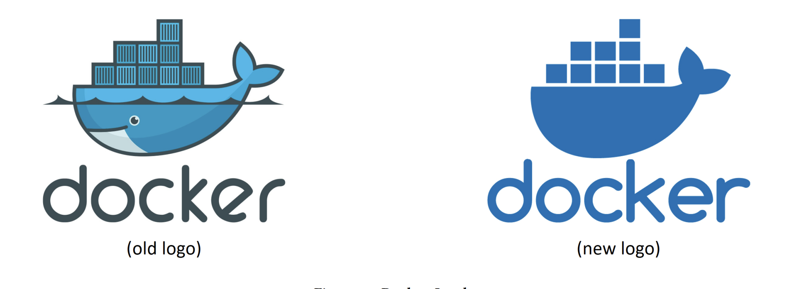
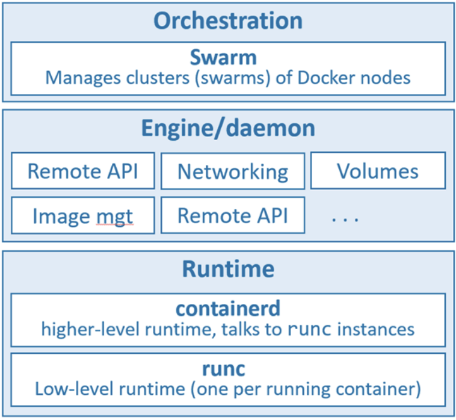
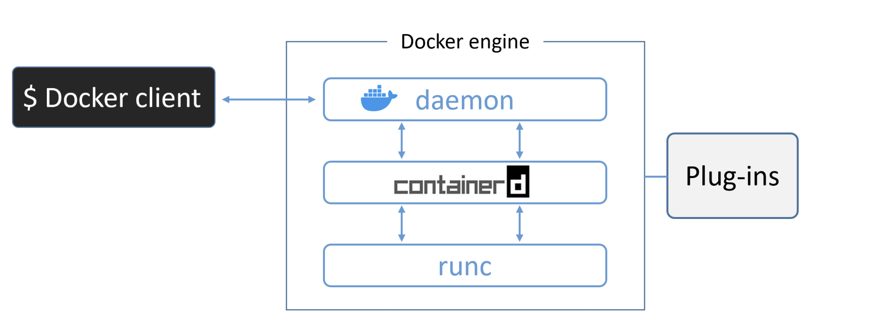
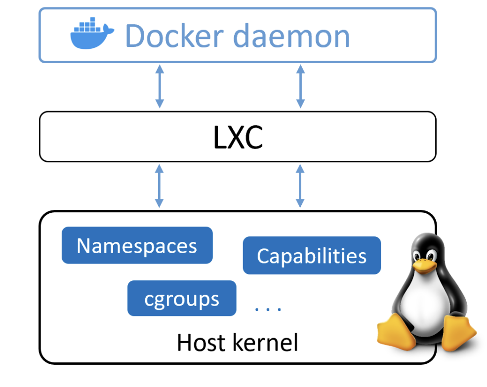
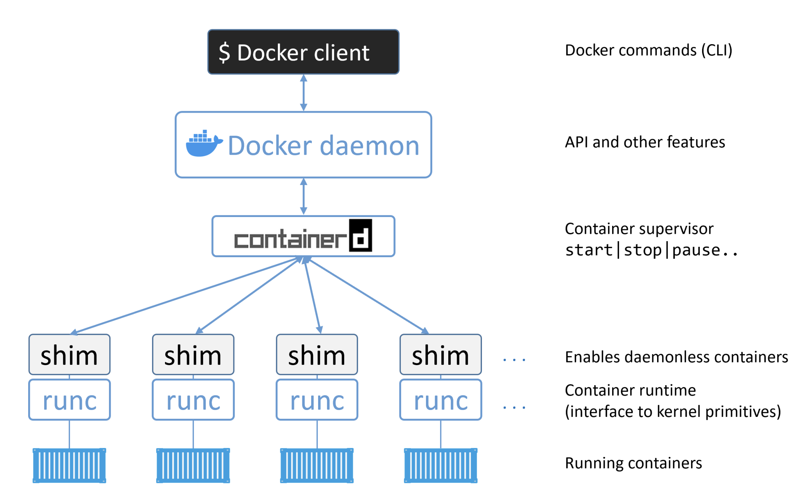

# Inception 

 <small> Deep Dive In :</small>

# 1. Introduction
### Why should I care about Docker?
- Docker is here and there’s no point hiding. In fact, if you want the best jobs working on the best tehnologies,
you need to know Docker and containers.

### What if I’m not a developer
- If you think Docker is just for developers, prepare to have your world turned upside-down.
Most applications, even the funky cloud-native microservices ones, need high-performance production-grade
infrastructure to run on. If you think traditional developers are going to take care of that, think again. To cut
a long story short, if you want to thrive in the modern cloud-first world, you need to know Docker. But don’t
stress, this book will give you all the skills you need.

### The bad old days
- Containers have revolutionized the way applications are deployed and managed. Traditionally, each application required its own server, leading to inefficiencies and wastage. VMware's virtual machines (VMs) offered a solution by allowing multiple applications to run on a single server, optimizing resource utilization. However, VMs have drawbacks, such as resource-intensive operating systems and slow boot times.

- Enter containers. Popularized by tech giants like Google, containers offer a lightweight alternative to VMs. Unlike VMs, containers share the host's operating system, leading to significant resource savings and improved portability. They boot quickly and are easily portable across different environments, from laptops to cloud platforms. Containers represent a more efficient and agile approach to application deployment, reducing costs and simplifying maintenance.

### Hello Containers
- Linux containers, a cornerstone of modern computing, owe their existence to extensive collaboration and contributions within the Linux community, notably from Google LLC. Key technologies like kernel namespaces, control groups, union filesystems, and Docker have fueled the exponential growth of containers.

- Despite their complexity, containers were made accessible to a broader audience with the advent of Docker. While other operating system virtualization technologies predate Docker, such as BSD Jails and Solaris Zones, this book focuses on modern containers popularized by Docker.

- Docker, Inc. simplified container usage, democratizing their adoption and making them accessible to all. We'll delve deeper into Docker's role in the next chapter.

# 2. Docker overview
### What is Docker?

- Docker is software for creating, managing, and orchestrating containers on Linux and Windows. It's built from various tools within the Moby open-source project. Docker, Inc., the company behind it, was founded by Solomon Hykes but he's no longer with the company. Their focus is on simplifying the process of running code from your laptop in the cloud.

### The Docker technology
- When most people talk about Docker, they’re referring to the technology that runs containers. However, there
are at least three things to be aware of when referring to Docker as a technology:
> 1. The runtime
> 2. The daemon (a.k.a. engine)
> 3. The orchestrator

 

<small>this figure shows the three layers and will be a useful reference as we explain each component.</small>

- Docker's runtime architecture involves two main components: runc and containerd. Runc, the low-level runtime, handles starting and stopping containers by interacting with the OS. Containerd, the higher-level runtime, manages the entire container lifecycle, including image pulling and network management. Dockerd, the Docker daemon, sits above containerd and provides an easy-to-use interface for managing containers, images, volumes, and networks. Additionally, Docker supports cluster management through Docker Swarm, although Kubernetes is becoming the preferred choice for most users.

### The Open Container Initiative
- The Open Container Initiative (OCI) is a governing body responsible for standardizing fundamental components of container infrastructure, focusing on image format and container runtime. Initially, CoreOS introduced an open standard called appc and an implementation called rkt, which competed with Docker. To avoid fragmentation, the industry came together to form the OCI, resulting in the publication of two specifications: the image-spec and the runtime-spec. These specifications, akin to standardized rail tracks, allow for innovation while ensuring compatibility across container platforms. The OCI's standards have greatly influenced Docker's architecture, aligning it with OCI runtime spec starting from Docker 1.11.

### Docker engine
- The Docker engine, often simply referred to as Docker, is the core software responsible for running and managing containers. Think of it akin to VMware's ESXi. It's modular in design, built from various specialized tools adhering to open standards like those set by the Open Container Initiative (OCI). Similar to a car engine composed of specialized parts, the Docker Engine comprises components like the Docker daemon, containerd, runc, and plugins for networking and storage. Together, these components create and run containers.

 

 

### Docker engine deep dive
- When Docker was first released, it comprised two main components: the Docker daemon and LXC. The daemon, a monolithic binary, encompassed the Docker client, API, container runtime, and more. LXC provided access to essential container features in the Linux kernel, like namespaces and control groups. However, the reliance on LXC posed challenges as it was Linux-specific and hindered multi-platform aspirations. Docker, Inc. addressed this by developing libcontainer, a platform-agnostic tool to replace LXC. Libcontainer became the default execution driver in Docker 0.9. Additionally, Docker, Inc. recognized the limitations of the monolithic daemon and embarked on a significant effort to modularize it. This involved breaking down the daemon into smaller, specialized tools, aligning with the Unix philosophy of building modular components. As a result, all container execution and runtime code were extracted from the daemon and refactored into separate, interchangeable tools.

 

    

    

## 3. Use docker
### Install docker

- MacOs
Docker: Desktop for Mac provides a convenient way to run Docker and Kubernetes on your macOS system. However, it operates within a lightweight Linux VM rather than natively on the macOS kernel. This means Docker commands run as expected, but only Linux-based Docker containers are supported. Installation is straightforward; simply search for "install Docker Desktop," download the installer, and follow the instructions. You can choose between stable and edge channels for feature updates. After installation, start Docker Desktop from the Launchpad, and use the Docker commands in the terminal as usual. Remember, while the Docker client is native to macOS, the Docker daemon runs within the Linux VM.

- For 42 Student you can run the script ./init_docker.sh inside this repo https://github.com/alexandregv/42toolbox.git to use docker in goinfre !

